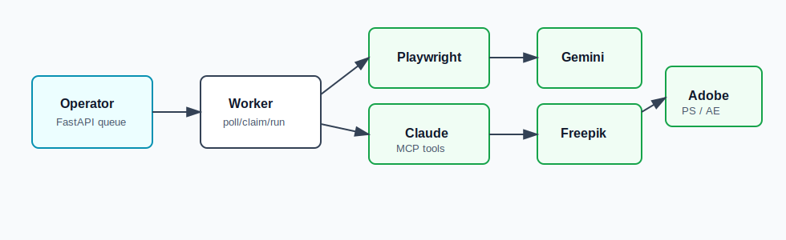

# Creative Workflow — Worker


> **Status:** pet project, actively developed, not production. Gate A — the Gemini → Freepik browser flow — is the first slice; Photoshop and After Effects bridges are scaffolded but not live yet.

**Creative Workflow** is a small automation system for design agencies that work through web tools — Gemini, Freepik, Kling — instead of paid APIs. You describe a brief once; the system queues up every variation, runs the browser clicks for you across your existing accounts, and drops the results into a single dashboard you can review. One "operator" laptop runs the brain and the UI. Each designer's laptop runs a "worker" that drives their own browser sessions, so your subscriptions, cookies, and account history stay where they belong. It's a pet project, not a SaaS — built to remove the most repetitive parts of a real creative workflow without replacing the designer's judgement.

This repo is the **worker side** — what runs on each designer's laptop.

## Three repos, one project

```text
creative-workflow-docs-library   ── specs, runbooks, prompts, skills (the design library)
creative-workflow-operator       ── runs once, on the operator laptop  ──┐
                                                                          │  jobs, heartbeats, artifacts
creative-workflow-worker         ── runs on each designer's laptop    ──┘
```

If you're a designer joining an existing setup, start here. If you're the one setting up the dashboard, start with [`creative-workflow-operator`](https://github.com/DanilShat/creative-workflow-operator) instead. The docs library is read-only reference material — you don't need it to run anything.

## What it does on your laptop

- Opens *your* Chrome profile, signed into *your* Gemini and Freepik accounts — nothing is shared, nothing is uploaded to a third-party service.
- Watches a queue from the operator and runs the click-through work for you while you do something else (or sleep).
- Uploads finished assets back to the operator dashboard automatically — no manual copy-paste, no Drive folders to babysit.
- Stops the moment you touch the keyboard. You stay in control of the browser any time you want it back.

## Who this is for

A designer at a small creative agency or a solo designer who already pays for Gemini, Freepik, or Kling subscriptions and finds themselves doing the same prompt-and-download dance dozens of times per project.

**Not for:** anyone looking for a managed SaaS, a Photoshop plugin, or an API-first generation pipeline. This worker runs on Windows laptops you already own, against accounts you already have.

## Screenshots

Placeholder slots — replace with real captures once demo evidence is ready.

| | |
| --- | --- |
|  |  |
| Worker driving Gemini in your real browser profile. | The CLI showing register → heartbeat → claim → complete. |


## Architecture

How the worker connects to the operator and the creative tools, exported from **graphify**:



## Prerequisites

- Windows 10/11
- Python 3.11+
- Chrome installed (Playwright will manage its own copy too)
- A worker token from your operator

## Quick Start

Clone this repo on the designer laptop:

```powershell
git clone https://github.com/DanilShat/creative-workflow-worker.git <repo-root>
cd <repo-root>
```

We recommend `C:\creative-workflow-worker\app` so the setup script defaults match the runbook, but any clone path works.

Install and check:

```powershell
python -m pip install -e ".[test]"
python -m playwright install chromium
Copy-Item .env.worker.example .env.worker
notepad .env.worker
python -m creative_workflow.worker.cli config check
python -m creative_workflow.worker.cli healthcheck
```

Or run the setup script:

```powershell
powershell -NoProfile -ExecutionPolicy Bypass -File .\scripts\setup_designer_one_click.ps1
```

Run:

```powershell
python -m creative_workflow.worker.cli run
```

Update later:

```powershell
powershell -NoProfile -ExecutionPolicy Bypass -File .\scripts\update_designer_from_git.ps1
```

## Runtime Notes

Real worker tokens, browser profiles, temporary files and cookies stay local and must never be committed. Commit only `.env.worker.example`.

## What's next

Gate B brings After Effects motion-design jobs into the same queue. Gate C adds a lightweight reviewer flow so a creative director can approve or reject variants from their phone. Issues and ideas welcome — this is a personal project, so PRs are reviewed case-by-case.
